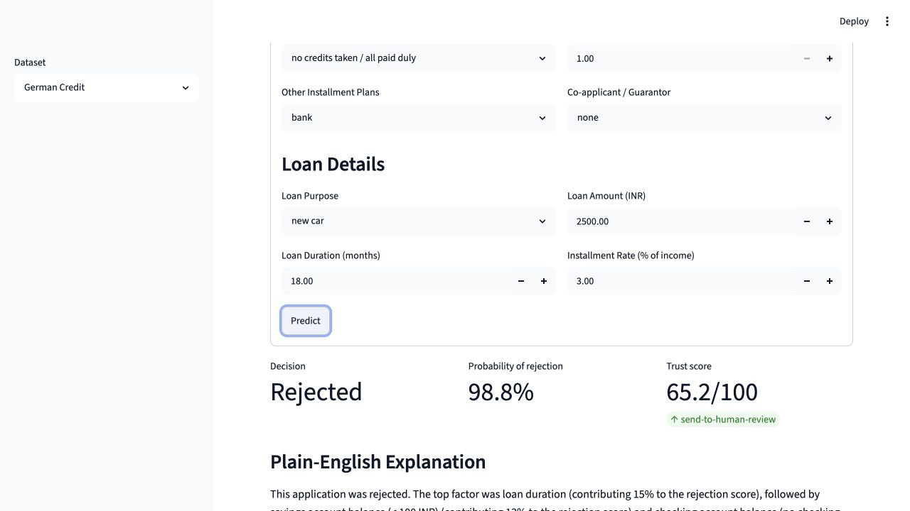
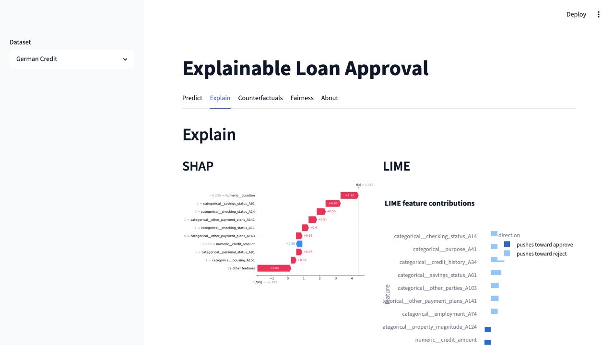
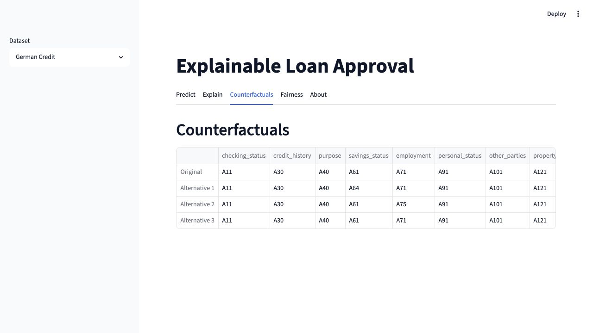
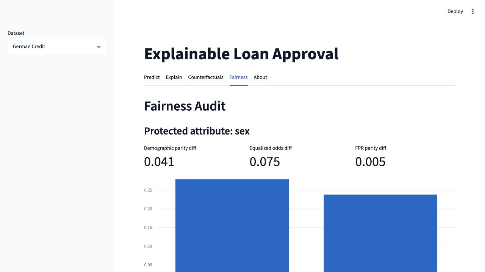

# Explainable Loan Approval


An end-to-end explainable machine learning system for loan approval decisions.
The project trains credit-risk models, explains each prediction with SHAP and
LIME, generates counterfactual "what would need to change" scenarios, audits
group fairness, and exposes the workflow through a Streamlit dashboard.

This is designed as a portfolio-grade decision-support demo: transparent,
testable, reproducible, and honest about model limitations.

## Demo

| Prediction workflow | Local explanations |
|---|---|
|  |  |

| Counterfactuals | Fairness audit |
|---|---|
|  |  |

## What It Does

- Trains Logistic Regression, Random Forest, and XGBoost models on public credit datasets.
- Uses a reusable preprocessing pipeline for categorical encoding, numeric scaling, missing values, and SMOTE class balancing.
- Explains model behavior globally and locally with SHAP.
- Cross-checks local explanations with LIME.
- Generates DiCE counterfactuals to show realistic decision-changing alternatives.
- Audits group-level fairness with demographic parity, equalized odds, and false-positive-rate parity metrics.
- Produces a deterministic plain-English narrative for every prediction.
- Computes a Trust Score that combines model confidence, SHAP/LIME agreement, and counterfactual feasibility.
- Ships with a Streamlit dashboard and unit tests for the core ML, XAI, fairness, and trust-score logic.

## Why This Project Is Different

Most credit-scoring demos stop at a model metric or a SHAP plot. This project
adds a decision-support layer around the model:

1. **Plain-English narrative**

   SHAP values and counterfactuals are converted into concise text that a
   non-technical reviewer can understand.

2. **Trust Score**

   The system does not treat every prediction equally. It scores whether the
   prediction is confident, whether SHAP and LIME agree, and whether the
   counterfactuals are realistic. Low-trust decisions are routed to human review.

## Architecture

```text
Applicant data
    |
    v
Data layer
    - dataset loaders
    - missing-value handling
    - one-hot encoding
    - numeric scaling
    - SMOTE on training data
    |
    v
Model layer
    - Logistic Regression
    - Random Forest
    - XGBoost
    |
    v
Explainability layer
    - SHAP global and local explanations
    - LIME local explanation cross-check
    - DiCE counterfactual generation
    - Fairlearn fairness audit
    |
    v
Decision-support layer
    - plain-English narrative
    - Trust Score and routing verdict
    |
    v
Streamlit dashboard
```

## Results Snapshot

| Dataset | Model | Accuracy | Precision | Recall | F1 | ROC-AUC |
|---|---:|---:|---:|---:|---:|---:|
| German Credit | Logistic Regression | 0.755 | 0.773 | 0.866 | 0.817 | 0.797 |
| German Credit | Random Forest | 0.760 | 0.781 | 0.857 | 0.817 | 0.792 |
| German Credit | XGBoost tuned | 0.748 | 0.770 | 0.851 | 0.808 | 0.776 |
| Home Credit | XGBoost at 0.5 threshold | 0.920 | 0.161 | 0.041 | 0.065 | 0.721 |

The Home Credit result is intentionally reported with its limitation: the
default 0.5 threshold produces weak recall on the minority default class.
The AUC shows useful ranking signal, but a production system would need
threshold tuning against a cost model and a deeper fairness review.

## Tech Stack

- Python 3.11
- pandas, NumPy
- scikit-learn, XGBoost, imbalanced-learn
- SHAP, LIME, DiCE
- Fairlearn
- Streamlit, Plotly, Matplotlib, Seaborn
- pytest

## Repository Layout

```text
.
├── app/
│   ├── field_specs.py
│   └── streamlit_app.py
├── data/
│   ├── README.md
│   └── download_data.py
├── docs/
│   └── images/
├── scripts/
│   ├── generate_report_assets.py
│   └── train_all.py
├── src/
│   └── xai_loan/
│       ├── data/
│       ├── explainers/
│       ├── fairness/
│       ├── models/
│       ├── trust/
│       └── utils/
├── tests/
├── PROJECT_SPEC.md
├── requirements.txt
└── pyproject.toml
```

## Quick Start

### 1. Clone the repository

```bash
git clone https://github.com/kiingkunal/xai-loan-approval-v1.git
cd xai-loan-approval-v1
```

### 2. Create and activate a virtual environment

```bash
python3.11 -m venv .venv
source .venv/bin/activate
```

If `python3.11` is not available, install Python 3.11 first. The project is
pinned to Python `>=3.11,<3.12` to keep the ML dependency stack stable.

### 3. Install dependencies

```bash
pip install -r requirements.txt
pip install -e .
```

### 4. Download data

German Credit downloads automatically:

```bash
python data/download_data.py
```

Home Credit is hosted on Kaggle and requires accepting the competition rules
and configuring the Kaggle CLI. See [data/README.md](data/README.md) for the
full setup. After Kaggle is configured:

```bash
python data/download_data.py --home-credit
```

### 5. Train models

For a fast local demo using German Credit only:

```bash
python scripts/train_all.py --skip-home-credit
```

For the full workflow:

```bash
python scripts/train_all.py
```

Training writes model artifacts to `models/`, which is intentionally
gitignored because the files are generated and can be large.

### 6. Run the dashboard

```bash
streamlit run app/streamlit_app.py
```

Open the local URL Streamlit prints, usually:

```text
http://localhost:8501
```

## Running Tests

```bash
pytest
```

The test suite covers the loader, preprocessor, models, explainers,
counterfactuals, fairness audit, feature labels, narrative generator, and
Trust Score.

## Generated Artifacts

These directories are intentionally excluded from git:

- `data/german_credit/`
- `data/home_credit/`
- `models/`
- `reports/`
- `.venv/`

They are reproducible through the download and training scripts.

## Notes On Responsible Use

This project is a decision-support demo, not a production lending system.
Before any real-world use, the model would need:

- threshold tuning against business costs,
- calibration checks,
- deeper subgroup and intersectional fairness analysis,
- privacy and compliance review,
- monitoring for data drift,
- human review workflows and audit logging.

## Contributors

- [kiingkunal](https://github.com/kiingkunal)
- [Jatin Dhiman](https://github.com/jatindhimangit)

## License

MIT License. See [LICENSE](LICENSE).
